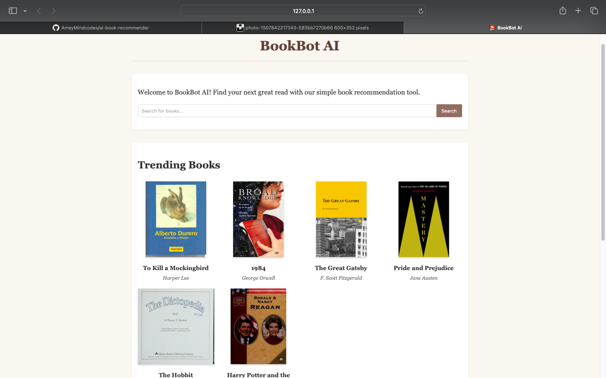

# BookBot AI: AI-Powered Book Recommendation Chatbot

BookBot AI is an intelligent chatbot designed to help book enthusiasts discover their next great read. Leveraging AI and real-time book APIs, BookBot AI provides personalized book recommendations based on various criteria such as author, genre, and content similarity.



## Features

- **Natural Language Understanding**: Communicate with the chatbot using natural language
- **Multiple Recommendation Methods**:
  - Content-based recommendations using book metadata
  - Author-based recommendations
  - Genre-based recommendations
  - Trending and popular books
  - Random recommendations
- **Real-time Book Data**: Uses multiple APIs to fetch up-to-date book information:
  - Google Books API for comprehensive book details
  - Open Library API for trending and popular books
  - New York Times Books API for bestsellers (optional)
- **Book Details**: Get comprehensive information about specific books
- **Search Functionality**: Search for books by title, author, or genre
- **Modern UI**: Clean, responsive interface with a typing indicator and smooth animations
- **Caching System**: Efficient caching of API responses to improve performance

## Installation

### 1. Clone the repository

```bash
git clone https://github.com/yourusername/ai-book-recommender.git
cd ai-book-recommender
```

### 2. Create a virtual environment

```bash
# On Windows
python -m venv .venv
.\.venv\Scripts\activate

# On macOS/Linux
python3 -m venv .venv
source .venv/bin/activate
```

### 3. Install dependencies

```bash
pip install -r requirements.txt
```

### 4. Run the application

```bash
python run.py
```

The application will be available at http://127.0.0.1:5004/

## Usage

1. Open the application in your web browser
2. Use the search bar to search for books
3. Chat with BookBot AI for recommendations using natural language:
   - "Find books by Stephen King"
   - "Show me popular fantasy books"
   - "What are the highest rated books?"
   - "Find books similar to Harry Potter"
   - "Tell me about The Great Gatsby"
4. Type 'help' anytime to see all available commands

## How to Use BookBot AI

### Search Engine

1. **Basic Search**:
   - Enter your search query in the search box at the top of the page
   - Click the "Search" button or press Enter
   - Results will display below, showing book covers, titles, and authors
   - If no results are found, a message will be displayed

2. **Search Tips**:
   - For best results, use specific terms (e.g., "Harry Potter" instead of just "magic")
   - Include author names for author-specific searches (e.g., "J.K. Rowling")
   - Include genre terms for genre-specific searches (e.g., "fantasy novels")
   - The search engine searches across titles, authors, and book descriptions

### Chatbot

1. **Starting a Conversation**:
   - Scroll down to the "Chat with BookBot AI" section
   - Type your message in the input box
   - Click "Send" or press Enter to submit your message
   - The chatbot will respond with relevant book recommendations or information

2. **Chatbot Commands**:
   - **Help**: Type "help" to see all available commands and features
   - **Author Recommendations**: "Find books by [author name]" or "Books by [author name]"
   - **Genre Recommendations**: "Show me [genre] books" or "Recommend [genre] books"
   - **Title Search**: "Find books with '[title]' in the title"
   - **Similar Books**: "Books similar to [book title]" or "Similar to [book title]"
   - **Trending Books**: "What's trending now?" or "Show trending books"
   - **Popular Books**: "What are popular books?" or "Show popular books"
   - **Top-Rated Books**: "Show highest rated books" or "Best rated books"
   - **Random Recommendation**: "Suggest a random book" or "Give me a random recommendation"
   - **General Search**: "Search for [query]" or "Find [query] books"

3. **Example Queries**:
   - "Find books by Stephen King"
   - "Show me fantasy books"
   - "Find books with 'Harry Potter' in the title"
   - "Books similar to Lord of the Rings"
   - "What's trending now?"
   - "Show highest rated books"
   - "Suggest a random book"
   - "Search for books about artificial intelligence"

4. **Tips for Better Results**:
   - Be specific with your requests
   - Include key information like author names, genres, or book titles
   - If you don't get the expected results, try rephrasing your query
   - The chatbot understands natural language, so you can ask questions conversationally

## How It Works

BookBot AI uses several APIs and techniques to provide book recommendations:

1. **Google Books API**: Used for searching books, getting book details, and finding similar books
2. **Open Library API**: Used for trending and popular books
3. **NYT Books API** (optional): Used for bestseller lists
4. **Natural Language Processing**: Processes user queries to understand intent and extract relevant information
5. **Caching System**: Caches API responses to improve performance and reduce API calls

## Project Structure

```
ai-book-recommender/
├── app/
│   ├── __init__.py           # Flask application factory
│   ├── api/                  # API routes
│   │   ├── __init__.py
│   │   └── routes.py
│   ├── main/                 # Main routes
│   │   ├── __init__.py
│   │   └── routes.py
│   ├── models/               # Data models
│   │   ├── __init__.py
│   │   ├── book_service.py   # Book API integration
│   │   └── chatbot.py        # Chatbot logic
│   ├── static/               # Static assets
│   │   ├── css/
│   │   │   └── style.css
│   │   ├── js/
│   │   │   └── script.js
│   │   └── images/
│   ├── templates/            # HTML templates
│   │   └── index.html
│   └── utils/                # Utility functions
│       ├── __init__.py
│       └── cache.py          # Caching system
├── static/                   # Static assets (root level)
│   ├── script.js
│   └── style.css
├── .gitignore                # Git ignore file
├── api_docs.html             # API documentation
├── requirements.txt          # Python dependencies
├── run.py                    # Application entry point
└── README.md                 # Project documentation
```

## API Integration

BookBot AI integrates with the following APIs:

### Google Books API

Used for:
- Searching books by title, author, or genre
- Getting book details
- Finding similar books
- Getting book cover images

### Open Library API

Used for:
- Getting trending books
- Getting popular books

### NYT Books API (optional)

Used for:
- Getting bestseller lists

## Technologies Used

- **Backend**: Python, Flask
- **APIs**: Google Books API, Open Library API, NYT Books API
- **Frontend**: HTML, CSS, JavaScript
- **Deployment**: Gunicorn (for production)

## License

This project is licensed under the MIT License - see the LICENSE file for details.

## Acknowledgments

- Special thanks to the open-source community for the libraries used in this project
- Book data provided by Google Books, Open Library, and NYT Books APIs

## Live Demo

A live demo of the application is available at: https://bookbuddy-u2y7.onrender.com
